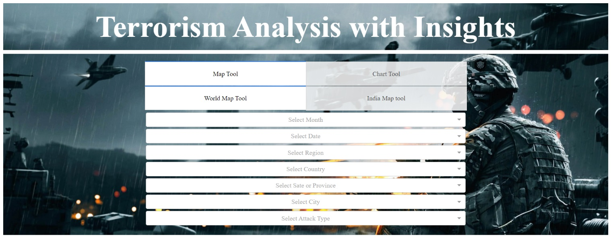

# Terrorism-Analysis-and-finding-Insights-Application

“Terrorism Analysis and Finding Insights Application” is web application which will be used for predicting and analysing terrorism patterns and insights. 
User Interface of Application is created using Dash (Plotly), HTML and CSS. 
And for backend Python is used.
This will be utilized by the client to discover the patterns of every sort of attack(such as:  Assassination, Kidnapping, Bombing, Hijacking, etc.).
# To run this follow steps below:

1) Open Anaconda Prompt.
(Make sure you downloaded the terror.yml script to the same directory so that Conda can find it.)
2) Go inside the directory us cd command and run the following command:
    conda env create -v -f terror.yml

3) To enter this environment, you must use the following command. You must execute this command every time you open a new Anaconda/Miniconda terminal window:

    conda activate Terror_Analysis
4) Run the application using following command:
    python task.py

This application will likewise help in finding and analyzing by visualizing the map or chart by applying following filters:

</> 	Map Tool :
•	Month Multi-select Dropdown
•	Date Multi-select Dropdown
•	Region Multi-select Dropdown
•	Country Multi-select Dropdown
•	State Multi-select Dropdown
•	City Multi-select Dropdown
•	Attack Type Multi-select Dropdown
•	Year Slider 
•	There is a year range slider for changing year.
.png)

.png)

•	Note: India map tool: the region and country are fixed and set to south Asia and India respectively.

.png)

</> 	Chart Tool :
•	Terrorist Group 
•	Type of Attack
•	Region
•	Target Nationality
•	Target Type
•	Country Attacked
•	Weapon Type
•	Year Slider

.png)

•	There is a Search box filter where user can enter specific keyword to search.
•	There is a year slider same as year slider in map tool.
•	Note: In India chart tool, the region and country are fixed and set to South Asia and India respectively. 

.png)

This project works in a following way: 

•	User can run the Python content from a terminal or a CMD and it opens application in a default Web Browser.
the blend of Month, Day, Attack Type, Region,Country, State, City. 
•	User can see the visualizations and based on that he/she can analyse and predict the forthcomings.
•	Hovering and clicking on the graph shows the detailed data. 
•	Application has a Chart Tool and Map Tool for visualization of data.
•	Map Tool to generate a scatter Geo Map with markers for attacks happened.
•	Chart Tool to show stacked line graph pictures of the frequency of attacks in every year. 
•	User can change data dependent on year slider in both Map and Chart Tool.

For any query or support, email me at :- sammysid97@gmail.com
